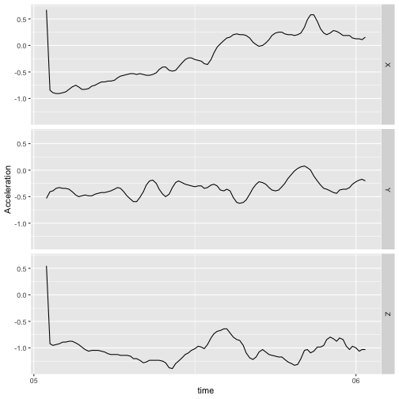

<!-- README.md is generated from README.Rmd. Please edit that file -->


# bis620.2023

<!-- badges: start -->
[](https://github.com/yixuanlyx/bis620.2023/actions/workflows/R-CMD-check.yaml)
<!-- badges: end -->

<!-- badges: start -->
[](https://github.com/yixuanlyx/bis620.2023/actions/workflows/test-coverage.yaml)
<!-- badges: end -->

The goal of bis620.2023 is to start the shiny app we built for checking information on clinicaltrials.gov website. 

## Installation

You can install the development version of bis620.2023 from [GitHub](https://github.com/) with:

``` r
# install.packages("devtools")
devtools::install_github("yixuanlyx/bis620.2023")
```

## Example

This is a basic example which shows you how to solve a common problem:


```r
library(bis620.2023)
## basic example code
accel |> 
  head(100) |> 
  plot_accel()
```

<div class="figure">

<p class="caption">plot of chunk example</p>
</div>

